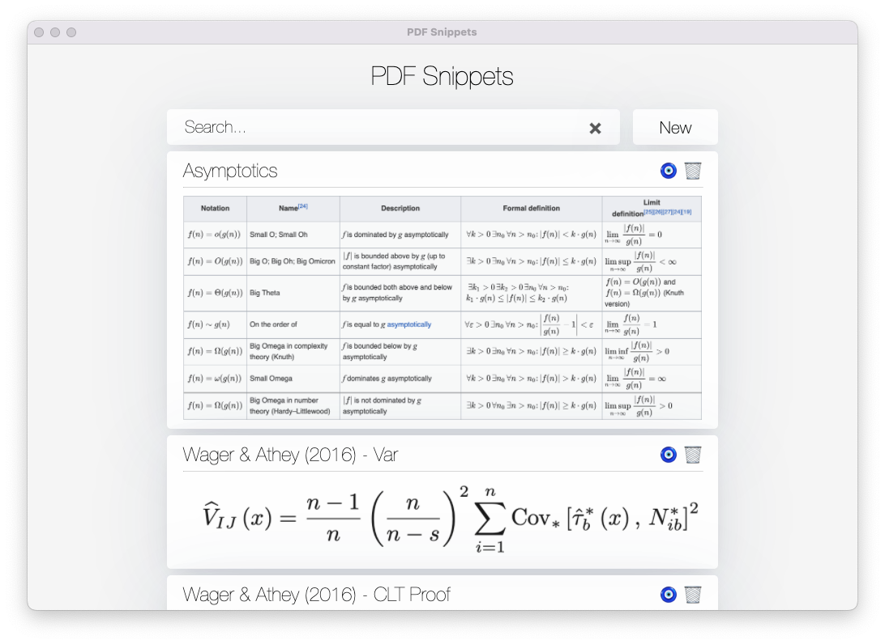

**PDF Snippets** is a tool to collect and manage snippets of knowledge[^1]. Each entry is simply a title, an image, and a reference to where the resource is located. Clicking on the '🧿 '  button will then open your web browser or PDF reader ([Skim.app](https://skim-app.sourceforge.io) only supported at the moment) to display the resource at its source.

PDF references also support providing a page number, which then allows PDF Snippets to open your PDF at the right page.

This app was built using [Electron React Boilerplate](https://github.com/electron-react-boilerplate).

[^1]: I realized later that the word snippet is not right here, but that doesn't really matter. Also, the tool evolved to handle links to webpages. So, both PDF and Snippets in 'PDF Snippets' are wrong.
